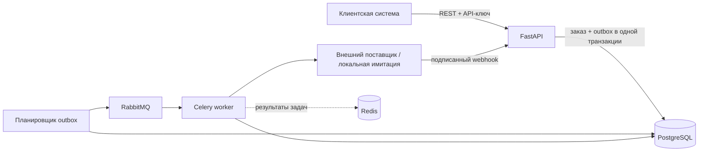

# Сервис интеграции и обработки заказов

Backend-модуль для компании, которая принимает заказы из клиентской системы и передаёт их
внешнему поставщику, складу или подрядчику. Сервис сохраняет заказ до сетевого вызова,
отправляет его в фоне и принимает обратные уведомления о выполнении.

Это не интернет-магазин и не пользовательское приложение. Проект представляет
интеграционную прослойку между двумя корпоративными системами, поэтому основным интерфейсом
служит REST API, а Swagger используется для демонстрации и ручной проверки.

## Бизнес-сценарий

1. Клиентская система отправляет заказ с собственным идентификатором.
2. Сервис проверяет товары, валюту и рассчитывает итоговую стоимость.
3. Заказ и задание на отправку сохраняются в PostgreSQL одной транзакцией.
4. Фоновый worker передаёт заказ внешнему поставщику.
5. При временной ошибке запрос повторяется с увеличивающейся задержкой.
6. Поставщик присылает подписанный webhook со статусом заказа.
7. Повторные запросы и webhook не создают дубликаты и не откатывают статус назад.

## Что показывает проект

- идемпотентное создание заказа через `Idempotency-Key`;
- изоляцию данных нескольких B2B-клиентов;
- транзакции, ограничения и индексы PostgreSQL;
- transactional outbox между API и очередью;
- RabbitMQ и Celery для фоновой передачи заказов;
- повтор временных ошибок и отдельную обработку постоянных отказов;
- HMAC-подпись, дедупликацию и упорядочивание webhook;
- историю попыток интеграции и correlation ID;
- миграции, демоданные, тесты, CI и воспроизводимый Docker-запуск.

## Архитектура



Проект намеренно реализован модульным монолитом. Очередь отделяет нестабильный внешний API
от ответа клиенту, но бизнес-модель и процесс обработки остаются в одном приложении.

## Быстрый запуск

Требуются Docker и Docker Compose.

```bash
cp .env.example .env
docker compose up --build -d
docker compose exec api python -m scripts.seed_demo
```

После запуска доступны:

- Swagger основного сервиса: [http://localhost:8000/docs](http://localhost:8000/docs);
- Swagger имитации поставщика: [http://localhost:8081/docs](http://localhost:8081/docs);
- RabbitMQ Management: [http://localhost:15672](http://localhost:15672), логин и пароль
  `orders`;
- API-ключ демонстрационного клиента: `demo-client-key`;
- административный ключ: `local-only-admin-key`.

## Как проверить через Swagger

### 1. Создать заказ

Открыть `POST /orders`, нажать **Try it out** и заполнить:

- `X-API-Key`: `demo-client-key`;
- `Idempotency-Key`: уникальное значение длиной от 8 символов, например `demo-order-0001`;
- тело запроса:

```json
{
  "external_id": "SHOP-1001",
  "currency": "USD",
  "items": [
    {"sku": "SKU-CHAIR", "quantity": 1},
    {"sku": "SKU-LAMP", "quantity": 2}
  ]
}
```

Первый ответ имеет код `201`, рассчитанную сумму `507.00` и статус `validated`.

### 2. Проверить фоновую отправку

Через несколько секунд вызвать `GET /orders` с тем же `X-API-Key`. Статус заказа станет
`submitted`, а поле `provider_order_id` получит идентификатор внешнего поставщика. Это
подтверждает, что outbox, RabbitMQ и Celery worker обработали заказ.

### 3. Проверить защиту от дублей

Повторить `POST /orders` с теми же телом и `Idempotency-Key`. Сервис вернёт исходный заказ с
кодом `200`, не создавая новую запись. Затем изменить количество, сохранив тот же ключ:
сервис вернёт `409 Conflict`, потому что один ключ нельзя использовать для разных запросов.

### 4. Проверить webhook поставщика

Скопировать `id` заказа и выполнить:

```bash
docker compose exec api python -m scripts.send_demo_webhook ORDER_ID confirmed \
  --api-url http://localhost:8000
docker compose exec api python -m scripts.send_demo_webhook ORDER_ID fulfilled \
  --api-url http://localhost:8000
```

После первого webhook статус станет `confirmed`, после второго — `fulfilled`. Повторная
отправка того же webhook вернёт результат `duplicate` и не выполнит переход ещё раз.

## Основные endpoints

| Метод и путь | Назначение |
|---|---|
| `POST /orders` | создать заказ или вернуть результат повторного запроса |
| `GET /orders/{id}` | получить заказ текущего клиента |
| `GET /orders` | получить список заказов с фильтрами и пагинацией |
| `POST /orders/{id}/cancel` | отменить заказ до отправки поставщику |
| `POST /webhooks/provider` | принять HMAC-подписанное событие поставщика |
| `GET /admin/provider-requests` | посмотреть историю попыток интеграции |
| `GET /health`, `GET /ready` | проверить процесс и подключение к базе |

Клиентские endpoints требуют `X-API-Key`, административный endpoint — `X-Admin-Key`, а
webhook — `X-Provider-Signature`, рассчитанный по точному телу запроса через HMAC-SHA256.

## Жизненный цикл заказа

```text
CREATED -> VALIDATED -> SUBMITTED -> CONFIRMED -> FULFILLED
    |          |            |            |
    +------> REJECTED <------+            +-> FAILED
               ^             |
               +-------------+

CREATED / VALIDATED -> CANCELLED
```

Потерянный промежуточный webhook не блокирует безопасное продвижение вперёд. Например,
событие `fulfilled` может перевести заказ из `submitted` через `confirmed` в `fulfilled`, но
старое событие `confirmed` не откатит уже выполненный заказ.

## Сценарии отказов

### Временная ошибка поставщика

Установить `PROVIDER_FAIL_FIRST_ATTEMPTS=2` в `.env`, пересобрать имитацию поставщика и
создать новый заказ:

```bash
docker compose up -d --build provider-mock
curl -H 'X-Admin-Key: local-only-admin-key' http://localhost:8000/admin/provider-requests
```

В истории будут две временные ошибки и успешная третья попытка.

### Перезапуск worker

Если остановить worker после создания заказа, сам заказ и outbox-событие останутся в
PostgreSQL. После запуска worker периодическая задача продолжит обработку. Внутренний ID
заказа отправляется поставщику как ключ идемпотентности, поэтому повторная доставка задачи
не должна создавать второй заказ на его стороне.

## Проверки качества

```bash
pytest --cov=app --cov-report=term-missing
ruff check .
ruff format --check .
```

Тесты проверяют авторизацию, изоляцию клиентов, расчёт стоимости, некорректные товары,
повторные ключи, конфликтующие запросы, переходы статусов, подписи webhook, дедупликацию,
нарушение порядка событий и конкурентные запросы PostgreSQL.

## Ключевые инженерные решения

1. Финальная защита идемпотентности — `UNIQUE(client_id, idempotency_key)` в PostgreSQL.
2. Каноническое тело запроса хешируется, поэтому тот же ключ нельзя использовать с другими
   данными.
3. Заказ и outbox-событие создаются одной транзакцией: подтверждённый заказ не теряет задачу
   на отправку при падении API.
4. Каждая попытка поставщику сохраняется до сетевого вызова, поэтому таймауты и падения
   worker остаются диагностируемыми.
5. Повторяются только таймауты, `408`, `425`, `429` и `5xx`; обычный `4xx` завершает заказ
   отказом без бессмысленных повторов.
6. PostgreSQL хранит бизнес-состояние и дедупликацию. Redis используется только как backend
   результатов Celery и не является источником истины.

## Ограничения MVP

- API-ключей достаточно для небольшого B2B-модуля; полноценная установка потребовала бы
  ротации ключей и scopes.
- Отмена разрешена только до отправки поставщику. Отмена на стороне поставщика потребовала бы
  отдельного асинхронного процесса сверки.
- Локальная имитация поставщика намеренно минимальна. Внешняя интеграция может потребовать
  OAuth, версионирование схем и проверки совместимости.
- Отдельный web-интерфейс не включён: сервис предназначен для межсистемной интеграции.

## Структура проекта

```text
app/
├── api/             HTTP-маршруты и авторизация
├── core/            настройки, безопасность и логирование
├── db/              SQLAlchemy-модели и сессии
├── integrations/    HTTP-адаптер внешнего поставщика
├── schemas/         контракты запросов и ответов
├── services/        бизнес-правила, идемпотентность и webhook
└── workers/         outbox relay и отправка поставщику
migrations/          история схемы Alembic
provider_mock/       локальная имитация внешнего API
scripts/             демоданные и отправка подписанного webhook
tests/               unit, integration и PostgreSQL concurrency tests
```
