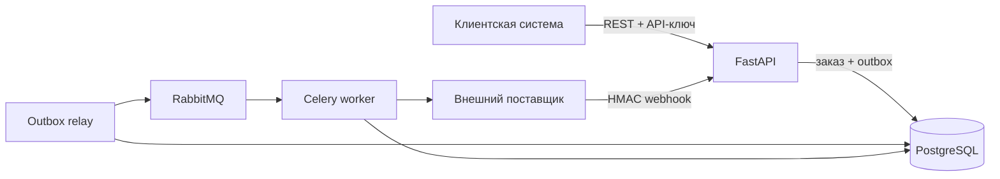

# Сервис интеграции заказов

[](https://github.com/maunti689/order_integration_service/actions/workflows/ci.yml)

Backend-модуль принимает заказы от B2B-клиентов и надёжно передаёт их внешнему поставщику.
API фиксирует заказ до сетевого вызова, фоновый worker выполняет отправку, а подписанные
webhook обновляют состояние без дублей и обратных переходов.

**Стек:** FastAPI, PostgreSQL, RabbitMQ, Celery, SQLAlchemy, Alembic, Docker.

## Гарантии надёжности

- `Idempotency-Key` вместе с fingerprint запроса защищает от повторного создания заказа.
- Заказ и outbox-событие сохраняются одной транзакцией.
- Unique constraints завершают защиту при конкурентных запросах.
- Временные ошибки поставщика повторяются, постоянные `4xx` завершают обработку без ретраев.
- HMAC-подпись, идентификатор события и монотонные переходы защищают обработку webhook.

## Поток обработки



RabbitMQ изолирует ответ API от доступности поставщика. Результаты Celery-задач не
сохраняются отдельно: бизнес-состояние и история попыток находятся в PostgreSQL.

## Запуск

Требуются Docker и Docker Compose.

```bash
cp .env.example .env
docker compose up --build -d
docker compose exec api python -m scripts.seed_demo
```

После запуска доступны:

- основной Swagger: [http://localhost:8000/docs](http://localhost:8000/docs);
- Swagger имитации поставщика: [http://localhost:8081/docs](http://localhost:8081/docs);
- RabbitMQ Management: [http://localhost:15672](http://localhost:15672), логин `orders`,
  пароль `local-only-orders`;
- API-ключ демонстрационного клиента: `demo-client-key`;
- административный ключ: `local-only-admin-key`.

## Проверка основного сценария

В `POST /orders` передать заголовки `X-API-Key: demo-client-key` и уникальный
`Idempotency-Key`, например `demo-order-0001`:

```json
{
  "external_id": "SHOP-1001",
  "currency": "USD",
  "items": [
    {"sku": "SKU-CHAIR", "quantity": 1},
    {"sku": "SKU-LAMP", "quantity": 2}
  ]
}
```

Первый запрос вернёт `201` и статус `validated`. Через несколько секунд `GET /orders`
покажет статус `submitted` и `provider_order_id`. Повтор с тем же ключом и телом вернёт
исходный заказ, а повтор с изменённым телом — `409 Conflict`.

Для проверки webhook подставить идентификатор созданного заказа:

```bash
docker compose exec api python -m scripts.send_demo_webhook ORDER_ID confirmed \
  --api-url http://localhost:8000
docker compose exec api python -m scripts.send_demo_webhook ORDER_ID fulfilled \
  --api-url http://localhost:8000
```

## Сценарии отказов

### Временная ошибка поставщика

Установить `PROVIDER_FAIL_FIRST_ATTEMPTS=2` в `.env`, пересобрать имитацию и создать новый
заказ:

```bash
docker compose up -d --build provider-mock
curl -H 'X-Admin-Key: local-only-admin-key' \
  http://localhost:8000/admin/provider-requests
```

История запросов покажет две временные ошибки и успешную третью попытку.

### Перезапуск worker

Если worker остановится после создания заказа, запись и outbox-событие останутся в
PostgreSQL. После перезапуска обработка продолжится. Внутренний ID заказа используется как
ключ идемпотентности на стороне поставщика.

## API

| Метод и путь | Назначение |
|---|---|
| `POST /orders` | создать заказ или вернуть результат повтора |
| `GET /orders/{id}` | получить заказ текущего клиента |
| `GET /orders` | получить список с фильтрами и пагинацией |
| `POST /orders/{id}/cancel` | отменить заказ до отправки |
| `POST /webhooks/provider` | принять подписанное событие поставщика |
| `GET /admin/provider-requests` | посмотреть историю попыток интеграции |
| `GET /health`, `GET /ready` | проверить процесс и подключение к базе |

## Проверки

```bash
pytest --cov=app --cov-report=term-missing
ruff check .
ruff format --check .
```

Тесты покрывают авторизацию, изоляцию клиентов, расчёт стоимости, идемпотентность,
конкурентное создание, переходы статусов, подписи и дедупликацию webhook.

## Границы

- API-ключи подходят для небольшого интеграционного модуля; ротация и scopes не реализованы.
- Отмена доступна только до передачи поставщику.
- Локальная имитация поставщика не моделирует OAuth и версионирование внешних схем.
- Отдельный интерфейс не включён: основной потребитель сервиса — другая система.
